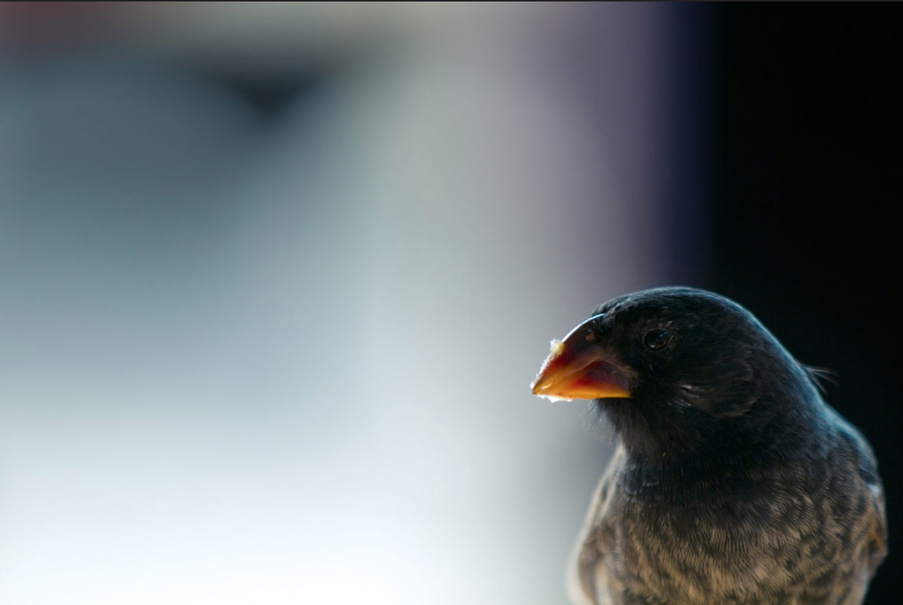

# finch-practical
quantitative genetics practical for evolutionary biology and developing R skills

----
**Learning Outcomes - evolutionary biology**  

  Estimate how much of the variation in a trait is due to heritable genetic variation  
  Quantify strength of selection  
  Predict how much the population will change from one generation to the next  

----
**Learning Outcomes - R**  

Input data from a .csv file  
Make scatterplots and histograms  
Calculate the slope of a regression line  
Calculate means  

---
Working through this practical should help you plot and interpret data collected from populations of Darwin’s medium ground finches (*Geospiza fortis*), so that you can quantify how populations respond to selection. This practical uses (mostly) real data taken from classic papers (on Canvas) that were among the first to demonstrate evolution as a result of natural selection in the wild.

You will be plotting your data using the open statistical software R (https://www.r-project.org/), using RStudio, because developing these skills will be useful throughout your ddegree, and especially for your final year. It will also look great on your CV. You may even enjoy it.

You will code a little “script” - a text file with all the instructions to plot the data - and you will be able to use this script in the data analysis assessment to analyse a dataset I provide there in exactly the same way. Head to [finch-instructions.md](finch-instructions.md) to get started.

---

Photo credit: https://www.flickr.com/photos/stefanocieri/

