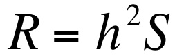

# Darwin’s finches- the Data			

You have a dataset called ["darwin finch data.csv"](darwin%20finch%20data.csv) which consists of beak depth measurements (in mm) for a large number of adult birds. Click on it and look at it in GitHub. The first two columns are parent-offspring beak depths. You can use these to see if there is an association between parent and offspring beak depths, and therefore get an idea of how heritable the trait is.

The third column is beak depths for 216 adult wild birds, measured in 1977. The fourth column is the fitness of those birds- a zero indicates that they didn’t reproduce, a 1 indicates that they did. The fifth column contains the beak depths of the offspring from the fourth column (136 birds).

Finally, I have included some beak depth data from the same species but a population from another island- El Garruptero. These data were collected in 2004 <sup>1</sup>.


Image credit: Forest and Kim Star https://www.flickr.com/people/97499887@N06


First, on the finch-practical main page https://github.com/domino-joyce/finch-practical you'll see at the top right, a green "Clone or Download" button. Click this, and save the zip file somewhere on your computer. Make sure you know where. Unzip the file, and you will find the data .csv files you need.

# Opening and using R

To start the program click on Start -> All Programs -> R -> Ri64.  Make sure you select the fastest version, i. e. Ri64 (not Ri32). R is a command line based software, i.e. you need to do a bit of programming and use codes. Once you open R you see the R Console window with the information on the version of R you are using – The R Console is where R runs all commands you ask for and returns the output. The symbol > in the R Console indicates that R is waiting for a command.

Click on **File** and select the option **New Script** (or **New Document** on a Mac). A new window appears: this is your ‘Script’ editing window – here is where you can type your commands, annotate them and save them for future use.

Save your Script where you want to keep your work: Click **File -> Save As…** and give it a name followed by the extension **.R**  **Save your work very frequently**. Note that this is a common text file that you can also open with any text editing software afterwards.

Annotations in the Script window must be preceded by the symbol ‘#’ so that they will not be read as command codes by R. Do make sure that all your annotations are preceded by this symbol. Annotations are just notes to yourself or other people about what your code does. Well annotated code will help you when you come back to it.

You can for example start annotating this file by typing in the Script window and press return:

```
  #Darwin finch analysis- parent-offspring regression
```

To import the data into R you first need specify in which folder R can find the data file. R calls folders ‘directories’. You can set the working directory for your R session as the place you have saved the zip file. Type the following command in your script window and press Return:

```
setwd("G:/Desktop")
```

The command setwd tells R to ‘set the working directory’ to the folder whose path is given in brackets within the speech marks. Here, we ask to go to the Desktop in your G: drive where you should have saved the finch data file. If you have saved the datafiles elsewhere you need to change the pathway within the speech marks accordingly. You can annotate this code by writing its meaning above it (or on the side) and preceding the annotation with the ‘#’ symbol.

```
setwd("G:/Desktop")		#set the working directory to the desktop
```

Note that the command is not yet live and nothing has happened in the R console. To execute the command, highlight the code in the script window and then press simultaneously the keys Ctrl and r. If you are on a Mac, highlight the line of code and press simultaneously cmd + Enter. Alternatively, you can highlight the code, right click and select the ‘Run line’ option. All these options send the command to the R Console. To check that R has gone to the correct folder, type in the Script window and run the command:

```
getwd()
```

With this command R returns the path to the currently active directory in the Console window, i.e. the folder you have chosen and where R saves your script file. Now, import the data file by running the code:

```
mydata<-read.csv("darwin finch data.csv", header = T)
```

The **read.csv** command tells R that the data file is a csv file (comma separated values). Within brackets are the details of the file, starting from the file name within the speech marks; do make sure you always type the extension of your file, here .csv, even if it is not visible in Windows. The last part of the code tells R that the file has column headers. Note that every element of the command line is separated by a comma. R requires that the imported data are given a name: we do this by typing a name of choice first, followed by <- on the left of this command line, so here we call the imported data ‘mydata’.

Everything on the right hand side of the **<-** gets sent to a thing called mydata once you execute this command.

NOTE. Because R works with codes, it is paramount that you do type the codes exactly as indicated. The vast majority of errors are due to typos, missing code elements, brackets or speech marks that are not open or closed, etc. R is also case sensitive. If you get an error message, do check these sources of error first.

Save your script.

To check the data have been correctly imported, run the following code:

```
names(mydata)
```

This should show you the heading of each column.

```
str(mydata)
```

This will give you the structure of the data- there are 216 observations and 6 variables (columns). You can also use

```
dim(mydata)
```

To give you the dimensions of the data file (216 observations in 6 columns). I also often use

```
	head(mydata)
```
which shows the top few rows of data. Each time, check the console window to see that it is showing you what you expect to see. Note that R calls a table of data a ‘data.frame’. R tells us that the data.frame ‘mydata’ has 216 observations, and 6 variables, whose names are parent_beak_depth_mm, offspring_beak_depth_mm, bill_depth_mm_1977,  X1977_reproduced, offspring_bill_depth_mm_1978, and El_G_2004.

Note that each variable is preceded by the dollar symbol such that in R language each data column is given a unique name as DataframeName$ColumnName. Because we called the data ‘mydata’ we have the following data columns: mydata$parent_beak_depth_mm, mydata$offspring_beak_depth_mm and mydata$bill_depth_mm_1977.... etc.

At this point, you may wish to annotate your script to explain what each line does. For example

```
str(mydata)
#this shows me the structure of "mydata"
```

**Now let’s do some evolutionary biology!**

# Does bill depth in Galapagos finches have a genetic basis?
To answer this question, we have beak depth data from parents and offspring. We can estimate the narrow sense heritability by looking for a relationship between these. If, when the parents beaks are deeper, the offspring beaks are also deeper, there is a correlation between parents and offspring.

The easiest way to do this, is to plot the parent bill depths against the offspring bill depths. If there is a genetic basis for bill depth, they should vary in the same way (deep-billed parents produce deep-billed offspring, and shallow billed parents producing shallow billed offspring).

These data are in the first two columns, called “parent_beak_depth_mm” and “offspring_beak_depth_mm”.

Make a scatterplot of parent beak depth against offspring beak depth using the **plot()** function:

```
plot(mydata$parent_beak_depth_mm, mydata$offspring_beak_depth_mm)
```

R should now have opened a graphics window containing your plot. Does it look as if there is a strong relationship between parent and offspring beak size?

We can make the graph look a little more professional by adding clear axes labels and a title, using the following code:

```
plot(mydata$parent_beak_depth_mm, mydata$offspring_beak_depth_mm,
  xlab = "mid parent beak depth (mm)",
  	ylab = "mid offspring beak depth (mm)",
 	 main = "beak depth heritability")
```

(for a figure in a paper, or a lab report, you wouldn’t need the “main” title, but its useful for now so we can keep track of our plots).

Have your saved your script recently? Do it now if not.

The slope of this line, gives you an estimate of the **narrow sense heritability**, and we can get R to calculate the slope using the linear model tool:

```
lm(mydata$offspring_beak_depth_mm ~mydata$parent_beak_depth_mm)
```

The R console should show you both the intercept (the number on the left), and the slope of the line (the number on the right), which is the narrow sense heritability. The closer this number is to 1, the higher the heritability. A low number here (less than about 0.35) means there is not a clear relationship between parents and offspring, and therefore no clear genetic component to the trait, which means it would be difficult for selection to act on this trait.

If you want to add a line to your plot, you can use the function **abline()**, and tell it to add the regression line you have already calculated. The easiest way to do this is to send the function above, to something easier to type using the <-

```
For example:
slope<-lm(mydata$offspring_beak_depth_mm ~mydata$parent_beak_depth_mm)
slope
abline(slope)
```

You could also use:

```
	abline(lm(mydata$offspring_beak_depth_mm ~mydata$parent_beak_depth_mm))
```

# How much variation in finch bill depth in the wild is there?

To get an idea how much variation there is in the wild, at least for 1977, we can plot the data from the third column “bill_depth_mm_1977” as a histogram.

```
hist(mydata$bill_depth_mm_1977)
```

Now add your own code to label the x and y axes properly, and add a title, by using the same code from the scatter plot, and changing the text. If you want to make the graph in a new window, use the following before the code for the plot:

```
	windows()
```

To work out the mean bill depth, use:

```
mean(mydata$bill_depth_mm_1977, na.rm=TRUE)
```

The **na.rm=TRUE** part of the code removes missing values. Missing values in R are coded as NA.

Which beak depth was the most frequent in 1977?
What was the mean beak depth in 1977?


Late in 1977 there was a severe drought, which affected the seed availability. Most spurge plants died, so there were not many of the small seeds available to the ground finches. Only a small number of finches were able to reproduce that year, and you can see this in the “X1977_reproduced” column. Most of the values are zeros.

How much beak variation in birds that reproduce is there?

Have you saved your script recently?

Let’s look at the data for those birds that did manage to reproduce. We want to make a histogram to show the number of individuals with each beak depth, but only for those that reproduced.

```
with(mydata, hist(bill_depth_mm_1977[X1977_reproduced==1]))
```

(Again, you should be able to add your own code to label the graph properly).

Of the birds that reproduced, which beak depth was the most frequent?
Is this higher or lower than the mean beak depth for the 1977 population as a whole?

Because of the drought, birds with large beaks that could process the other, larger, caltrop seeds, tended to be the ones who survived to reproduce.

To work out the mean beak depth of the birds that reproduced, use:

```
with(mydata, mean(bill_depth_mm_1977[X1977_reproduced==1]))
```

You can now work out the **selection differential**. This is simply the mean bill depth of the birds that contributed to the next generation, minus the mean bill depth of all the birds in the population.

```
breeders<-with(mydata, mean(bill_depth_mm_1977[X1977_reproduced==1]))
all<-mean(mydata$bill_depth_mm_1977, na.rm=TRUE)

selectiondifferential <- breeders - all
```

To get the selection differential, you now need to get R to print it, by typing:

```
selectiondifferential
```

# Predicting the Evolutionary Response to Selection

<p align="center">


We can use this equation to work out what the response to selection will be. We already know h2 from the slope of the mid-parent offspring plot. S is the selection differential you have just worked out. Simply multiply these two to get the response to selection, which is the
mean trait change in the next generation.

**Testing the prediction**  

We have the data on beak depth from the offspring that survived in 1978, in the column “offspring_bill_depth_mm_1978”.

Use your R coding skills to plot a histogram of these data and identify the most frequent bill depth found in 1978. You should also be able to calculate the mean beak depths in 1978. Are they bigger?
What about populations on other islands?
Plot a histogram of bill depths in this species from individuals on El Garrapatero, a different island. The data is in the column “El_G_2004”.

What could be going on there?


## Other useful R tips  

Before starting with the new analysis delete everything from the memory of R to avoid over-riding issues with variable names and outputs that might compromise your results with the next set of data. Erase the R memory by running the following code:

```
rm(list=ls())
```
If you want to make a window with multiple panels which you then populate with all your plots, you can use this code:
```
	par(mfrow=c(2,3))
```
This makes a window with 2 rows and 3 columns, which will open and be blank to start with. It will fill with the plots you make as you go along. You can change the number of rows and columns as you see fit.


In R, there are many ways of scripting the same outcome. Here are some alternative scripts for the selection differential calculations. What are the differences?

```
rep=subset(mydata,X1977_reproduced==1)
hist(rep$bill_depth_mm_1977)
mean(rep$bill_depth_mm_1977,na.rm=T)
bred=mean(rep$bill_depth_mm_1977,na.rm=T)
tot=mean(mydata$bill_depth_mm_1977,na.rm=T)
sd=bred-tot
sd
```

Well done - you've finished!

<p align="center">
  <br><br>
  

</p>

Now go to the Canvas quiz and fill in your answers to the questions to make sure you understand the evolutionary biology behind what you have done.


<sup>1</sup>The paper these data are from actually uses principal components rather than beak depth, so the data combine a number of traits. For simplicity and consistency, I have interpreted it for this practical as beak depth, since beak depth is the major contributor to principal component 1).
